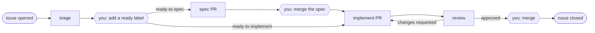

# Software Factory

A software factory that lives in GitHub Actions. Open an issue and Claude Code triages it. Add one label and it writes a spec, or builds the change on a branch with tests, reviews its own pull request, and answers the review until it passes. You decide by merging: the spec PR, then the code PR. Everything the factory knows about an item is on the issue and its PRs; nothing lands in your repo but one workflow file. The procedure the stations follow lives in a factory definition, a repository of skills that any number of your repositories can name.



Hexagons are yours. Everything else is a station: one headless `claude -p` run that reads a packet of context the workflow prepared, does its work, and reports a verdict the workflow turns into labels, a comment, and, for review, a PR review.

## Adopt

Commit [`templates/factory.yml`](templates/factory.yml) to your repository as `.github/workflows/factory.yml`. Then, once: add the `CLAUDE_CODE_OAUTH_TOKEN` secret (`claude setup-token`; it runs on your Claude subscription) or `ANTHROPIC_API_KEY`, and allow GitHub Actions to create and approve pull requests in the repository's Actions settings. Open an issue; the labels appear with the first run. Nothing is installed on a laptop and nothing runs on one: every station is a GitHub Actions job, and a human starts one by hand from the Actions tab, never from a terminal.

That file names two things. The `uses:` line is the toolkit, this repository: the reusable workflow, the packet builder, the CLI. The `definition:` line is the factory definition, the repository whose `skills/` the stations run; leave it empty to run the skills in this repository. To tune the factory for your product, copy this repository's `skills/` into a repository of your own, name it in `definition:`, and every repository that names it runs the same factory: one definition, a backend and a UI repository, one set of skills to improve. Add a `FACTORY_TOKEN` secret (contents and pull-requests write on the definition) so the weekly retro can open its proposals there.

**Upgrading from v2.1** (skills under `.claude/skills/`): replace `.github/workflows/factory.yml` with the current template and delete the nine `.claude/skills/` directories the installer created (`factory-*`, `write-product-spec`, `write-tech-spec`, `council`, `research`). A station refuses to run while a `factory-*` skill is still in the repository, and says so in the run log.

## What you see

Every station leaves one short comment on the issue: what happened, why, what to do next, details folded. Labels say where an item stands; yellow ones wait on you.

| Label | Means |
|---|---|
| `factory:triaged` | triage ran; its recommendation is the first line of its comment |
| `factory:needs-info` | triage needs the reporter; answer, then remove the label to triage again |
| `factory:ready-to-spec` | you asked for a spec |
| `factory:spec-review` | the spec PR is open; merge it to start implementation, or request changes |
| `factory:ready-to-implement` | you asked for the build, or the spec PR merged |
| `factory:in-review` | the factory is building and reviewing |
| `factory:ship-review` | review approved; merge the PR to ship, or request changes |
| `factory:needs-human` | three review rounds without you, or a station is stuck; look at the PR |

A merged code PR closes the issue (`Resolves #n`). Closing an issue as not planned parks it. A Request-changes review from you on either PR sends it back to the station that owns it, with your review in its packet; a comment in the PR conversation is read too.

## Metrics

`factory metrics` prints cost per shipped item, cycle time, autonomy (shipped with no human steer), and steers per item, all derived from the issues and PRs. It runs anywhere `gh` is logged in for the repo:

```bash
uv tool install /path/to/software-factory && factory metrics --since 30d
```

[docs/ARCHITECTURE.md](docs/ARCHITECTURE.md) has the labels and events in full, the factory definition and where the stations run, the four jobs, the packets, and the trust boundaries.

*Built on the skills and patterns in Warp's [cloud-factory-demo](https://github.com/warpdotdev/cloud-factory-demo).*
