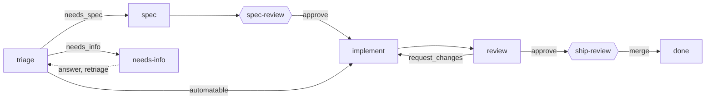

# Software Factory

A software factory that lives in GitHub. Label an issue, and Claude Code triages it, writes a spec when one is needed, implements it on a branch with tests, and reviews the pull request. You decide twice: approve the spec, merge the PR. Everything the factory knows about an item is on the issue and its PR; nothing is committed to your repo but a handful of skills.



Hexagons are human gates. Every other arrow is a station run: one headless `claude -p` process whose final message is a JSON verdict, applied by a small CLI that moves the label and leaves a run comment with the measured cost.

## Install

```bash
git clone https://github.com/fetch-rewards/software-factory && cd software-factory
uv tool install .                       # the `factory` CLI
./install.sh /path/to/your/repo         # copies the skills, creates the labels
./install.sh /path/to/your/repo --with-cloud   # also the GitHub Actions workflow
```

Commit what it copied. For the cloud workflow, add the `CLAUDE_CODE_OAUTH_TOKEN` secret (`claude setup-token`; it runs on your Claude subscription), set the `FACTORY_TOOLKIT_GIT` variable to a pip-installable ref of this repo, and allow Actions to create pull requests in the repo settings.

## Use

In a Claude Code session in your repo:

```
/factory new "tally crashes on a blank cell"   # files the issue and drives it to the first gate
/factory                                        # the board and the headline metrics
/factory 12 approve                             # a gate decision; request_changes "why" sends it back
```

Or without the driver: `factory run 12 --out r.json && factory apply 12 r.json`. In the cloud the same commands run when the label changes, and a PR review or merge records the gate.

`factory metrics` prints cost per shipped item, cycle time, autonomy (merged PRs with no human commit), and steers per item, all derived from the issues and PRs.

[docs/ARCHITECTURE.md](docs/ARCHITECTURE.md) has the primitives table, the transitions, and the runner contract.

*Built on the skills and patterns in Warp's [cloud-factory-demo](https://github.com/warpdotdev/cloud-factory-demo).*
