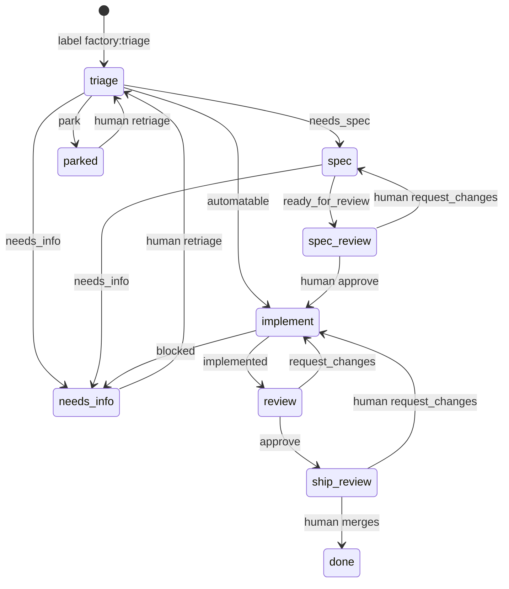

# Architecture

The factory is a thin deterministic layer over two runtimes it does not own: GitHub for state and Claude Code for work.

## Primitives

| Need | GitHub already has | The factory adds |
|---|---|---|
| Work item | Issue | nothing |
| State | One `factory:*` label | the transition table |
| Log | Issue comments, timeline | one run comment per station run, with hidden JSON |
| Artifacts | Branch `feature/<n>-<slug>`, its PR | the naming convention |
| Human gates | PR review, merge | `factory gate` to record the decision as a label move |
| Event bus | `labeled`, `pull_request_review`, `pull_request` events | `workflows/factory.yml` |
| Runtime | `claude -p` with skills, structured output, cost | `factory run` builds the one invocation |
| Metrics | Comments, timeline, PR commits | `factory metrics` derives them; nothing is stored |

## The line



`TRANSITIONS` in `factory/cli.py` is this diagram as data. `factory apply` refuses a report whose station is not the issue's current label or whose verdict is not in the table; `factory gate` refuses a decision the state does not accept. Three decisions are accepted from any active state: `done` and `park`, because a merge or a shelving is a fact rather than a routing decision, and `retriage`, which is how a human overrides a station's routing: the item returns to triage with the human's why as a comment triage reads.

## A station run

`factory run <issue>` reads the label, picks the station, and executes exactly one process, identically on a laptop and on a runner:

```
claude -p "/factory-<station> Issue #<n> in <owner/repo>. Branch: <feature/n-slug> (PR #m) | none yet."
  --output-format stream-json --verbose
  --model <from the skill's frontmatter>
  --allowedTools <from the skill's frontmatter>
  --permission-prompts none
  --max-budget-usd <per station>
  --json-schema <factory schema station>
  --append-system-prompt <factory/prompts/station.md>
```

It runs in a throwaway `git worktree` on the item's branch reset to origin's tip (or detached at the default branch when no branch exists), with `GIT_AUTHOR_*` set to `factory` so a human's commits on a factory PR stay distinguishable. The prompt carries the one fact the runner knows better than the station: whether the branch and PR already exist. Everything else the station fetches itself with the `gh` calls its skill names.

The `result` event's `structured_output` is the report. `factory run` adds `cost_usd` (Claude Code's list-price estimate from real token counts), `model`, `session_id`, `turns`, `duration_ms`, `run_url`, and the PR `head` the station read, and writes the JSON. `factory apply` validates it, refuses a report with tool-call markup leaked into a string field, posts the PR review for the review station anchored to that head and resolves the threads the report names, leaves the run comment, and moves the label. Retrying an apply with the same `session_id` posts nothing a second time. A station therefore needs no GitHub write access to review: every write it wants rides the report.

## The run comment

```
**factory · triage → automatable** · claude-sonnet-5 · $0.07 · 2m · [run](…)
Reproduced: a blank amount cell raises ValueError in total(); one-line guard plus a regression test.
<!-- factory:run {"verdict":"automatable","station":"triage","model":"claude-sonnet-5","cost_usd":0.0731,"session_id":"…","turns":9,"duration_ms":118000,"run_url":"…","ts":"…"} -->
```

Gate decisions leave a `**factory · gate → <decision>**` comment with the human's why and a `<!-- factory:gate {…} -->` record. Reviews the factory posts on a PR open with `Reviewed at <sha>` and end with `<!-- factory:review -->`; the next review diffs from that sha.

## Metrics

Per item: runs and cost from run comments; shipped and cycle time from the PR's `mergedAt` and the first `factory:triage` label event; steers from `request_changes` gate records plus commits on the PR whose author is not `factory`; autonomous when merged with no such commit. Headline: total cost divided by items shipped.

## Cloud

`workflows/factory.yml` runs the same commands. A `factory:*` label added by a human runs that station. Because a label added with `GITHUB_TOKEN` fires no `labeled` event, the apply job chains the next station with `gh workflow run`. Triage and review run with read-only tokens so nothing an issue or PR says can make the agent act on GitHub; spec and implement need write to push and open PRs. A human's PR review (owner, member, or collaborator only) or a merge runs the gate job, which derives the issue from the branch name. Jobs without a checkout set `GH_REPO` so `gh` still knows the repository.

Locally, a PR opened with your own token cannot be approved by you, so the spec gate is `/factory <n> approve`; in the cloud the bot owns the PR and the GitHub Approve button works. Merging is the ship approval in both.
