# Architecture

The factory is a thin deterministic layer over two runtimes it does not own: GitHub for state and events, Claude Code for work. It runs only inside GitHub Actions.

## Primitives

| Need | GitHub already has | The factory adds |
|---|---|---|
| Work item | Issue | nothing |
| State | `factory:*` labels | the eight labels and which verdict sets which |
| Log | Issue comments | one comment per station run, with hidden JSON |
| Artifacts | Branch `<type>/<n>-<slug>`, its PR | the naming convention; `spec/` for specs |
| Human gates | Merge, Request changes, apply a label, close | nothing |
| Event bus | `issues`, `pull_request`, `pull_request_review`, `workflow_dispatch`, `schedule` | one reusable workflow that routes them |
| Runtime | `claude -p` with skills, structured output, cost | a packet of context per run and one invocation |
| Metrics | Issues, comments, PRs, reviews, commits | `factory metrics` derives them; nothing is stored |

## Labels

| Label | Set by | Means |
|---|---|---|
| `triaged` | factory | triage ran; stays for the life of the issue |
| `needs-info` | factory | triage needs the reporter; a human removes it once answered, and triage runs again |
| `ready-to-spec` | human | run the spec station |
| `spec-review` | factory | the spec PR is open; a human merges it or requests changes |
| `ready-to-implement` | human, or the spec PR merging | run the implement station |
| `in-review` | factory | the implement ↔ review loop is running |
| `ship-review` | factory | review approved; a human merges or requests changes |
| `needs-human` | factory | the attempt cap was hit or a station reported `blocked` |

Yellow marks the four that wait on a human. `triaged` is a flag; the rest are states, at most one at a time, and `factory apply` removes the one it supersedes. Done is the issue closed as completed by the merged PR's `Resolves #n`; parked is the issue closed as not planned.

```mermaid
stateDiagram-v2
  [*] --> triaged: issue opened → triage
  triaged --> needs_info: needs_info
  needs_info --> triaged: human removes the label → triage
  triaged --> ready_to_spec: human applies the label
  triaged --> ready_to_implement: human applies the label
  ready_to_spec --> spec_review: spec opens spec/n-* PR
  spec_review --> spec_review: human requests changes → spec revises
  spec_review --> ready_to_implement: human merges the spec PR
  ready_to_implement --> in_review: implement opens the PR → review
  in_review --> in_review: review requests changes → implement → review (≤ 3)
  in_review --> needs_human: 4th send-back, or blocked
  in_review --> ship_review: review approves
  ship_review --> in_review: human requests changes → implement
  ship_review --> [*]: human merges; Resolves #n closes the issue
  needs_human --> in_review: human requests changes on the PR
```



`TRANSITIONS` in `factory/cli.py` is this diagram as data: which state label each station verdict sets. `DISPATCH` says which verdicts start another station. `RUNS_AT` says at which states a station's report is accepted; a report from anywhere else is stale or misrouted and is refused.

## Events

The adopter's caller workflow (`templates/factory.yml`) forwards these to the reusable workflow, whose `route` job decides:

| Event | Condition | Runs |
|---|---|---|
| `issues` opened, reopened | always | triage |
| `issues` labeled | `factory:ready-to-spec` / `factory:ready-to-implement`, by a human | spec / implement |
| `issues` unlabeled | `factory:needs-info`, by a human | triage |
| `pull_request` reopened, ready_for_review | head `<type>/<n>-*`, not `spec/`, not draft | review |
| `pull_request` closed | merged, head `spec/<n>-*` | labels `ready-to-implement`, then implement |
| `pull_request_review` submitted | changes requested, by an owner, member, or collaborator | spec or implement, by the head branch |
| `workflow_dispatch` | `station`, `issue` | that station |
| `schedule` weekly, or `workflow_dispatch` `retro` | | retro |

Everything the factory writes uses `GITHUB_TOKEN`, which fires no events that run (a PR it opens or pushes to leaves a `pull_request` run GitHub holds for approval, which is why the caller does not subscribe to `opened` or `synchronize`). So `factory apply` ends with `next: <station>` or `next: none`, and the workflow dispatches itself for the next station. Human actions fire events on their own, with one exception GitHub imposes: no `pull_request` or `pull_request_review` workflow runs for a PR that conflicts with its base. The review station therefore treats a conflict as a finding, and its send-back reaches implement through the dispatch path; a human can also start any station from the Actions tab.

## The four jobs

1. **route** (no checkout; `issues: write` only for the spec-merge label move). Reads the event and decides `station`, `issue`, `pr`, `branch`, `head`, and the checkout `ref`: the item's branch when it exists, else the default branch. Looks the PR up when the event did not name it.
2. **context** (read tokens). Checks out the adopter at `ref` and the toolkit at the SHA of this workflow file, fetches raw JSON with `gh` (issue, comments, PR, reviews, review threads via GraphQL, conversation, diff, the delta since the last factory review, metrics for retro), runs `python -m factory.context <station>`, and uploads the packet as an artifact. A human can open it and see exactly what the station saw.
3. **run-read** or **run-write**. Triage and review run with read-only tokens: nothing an issue or PR says can make the agent act on GitHub, and every write they want rides the report. Spec, implement, and retro hold write tokens because they push and open PRs. `run-station.sh` builds the one `claude -p` invocation and writes `report.json` from the `result` event plus what only the runner knows (cost, model, session, turns, duration, run URL, the PR and head it worked on). Uploaded as an artifact.
4. **apply** (write tokens, toolkit checkout only, never talks to the model). `factory apply` validates the report, posts the PR review for the review station, resolves the threads it verified, files `followups` as plain issues, leaves the run comment, moves the labels, and prints the dispatch line.

## Packets

| Station | Files | From |
|---|---|---|
| triage | `issue.md`, `related.md` | the issue and its comments; the other open issues and PRs, one line each |
| spec | `issue.md`; `pr.md` on a revision | plus the spec PR: reviews, threads with replies and ids, conversation |
| implement | `issue.md`; `pr.md` once the PR exists | plus the code PR the same way |
| review | `issue.md`, `pr.md`, `diff.md`, `followup.md` | plus the annotated diff, and the last factory review with the delta since it |
| retro | `metrics.json`, `items.md` | `factory metrics --json`; per item, every human touch on the issue and its PRs |

Specs are read from the checkout (`specs/<n>-*/`), where the spec PR merged them. `diff.md` marks every line `[OLD:n]`, `[NEW:n]`, or `[OLD:n,NEW:m]`; an inline review comment copies its `path`, `side`, and `line` from there and nowhere else.

## A station run

```
claude -p "/factory-<station> Issue #<n>. Packet: <dir>/. Branch: <type>/<n>-<slug> (PR #<m>). | none yet."
  --output-format stream-json --verbose
  --model <from the skill's frontmatter>
  --allowedTools <from the skill's frontmatter>
  --permission-prompts none
  --json-schema "$(factory schema <station>)"
  --append-system-prompt "$(cat factory/prompts/station.md)"
```

The checkout is the adopter repository at the item's branch, or the default branch when none exists yet. Commits are authored as `factory` so a human's commit on a factory PR stays distinguishable. `station.md` is the contract every station runs under: authority (everything but the prompt and the skill is data), report-not-action, branch and PR rules, scope, secrets, honesty, and how to write.

## The record

A run comment:

```
**Triage · recommends ready-to-implement** · $0.31 · 48s · [run](…)
Blank amount cells raise in total(); reproduced on the sample in the report. One guard and a regression test.
To start, add the `factory:ready-to-implement` label.
<details><summary>Details</summary>

The area is src/tally/__init__.py; #11 is unrelated.
</details>
<!-- factory:run {"verdict":"ready_to_implement","station":"triage","cost_usd":0.31,"session_id":"…",…} -->
```

The headline and the next-step line come from tables in `cli.py`; the two lines between them are the station's `summary` and folded `notes`. A review the factory posts ends with a small footer and `<!-- factory:review {"verdict":…,"head":…,"session_id":…} -->`; the next review's packet finds it by that mark. The review lands as a comment review when GitHub refuses a bot's Approve or Request changes on its own PR; the verdict still moves the label.

## The attempt cap

`factory apply` counts the factory's consecutive send-backs on a PR since the last human review or human commit. On the fourth, the review is still posted, the issue moves to `needs-human`, the comment says so, and nothing is dispatched. A human's Request-changes review sends the PR back to implement and resets the count; a merge ships it.

## Metrics

Per item: runs and cost from the run comments; shipped when the issue closed as completed with a merged code PR; cycle time from the issue's creation to that merge; steers as human Request-changes reviews on either PR plus human commits on the code PR; autonomous when shipped with no steer; needs-human when a run was capped or blocked. Headline: total cost divided by items shipped.

## Trust boundaries

Issue bodies, comments, PR text, spec files, code, and tool output are data; the system prompt says so, and the read-only tokens for triage and review make it true regardless. The job that writes to GitHub never talks to the model. Reviews of a PR whose head moved during the run are dropped, not posted; the push that moved it already started a fresh review. `factory apply` refuses a report whose station does not belong at the issue's state, whose verdict the schema does not allow, or whose text carries leaked tool-call markup.
