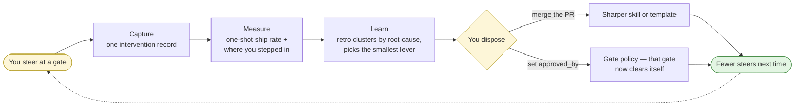

# The learning loop — how the factory improves itself

A pipeline runs the same way forever. A factory captures where it needed a human and re-tools so it doesn't next time: you decide once, and it carries that decision forever.

This doc is the mechanism. What *you* do with it is [FACTORY-MANUAL.md](../FACTORY-MANUAL.md) §4.

| Move | Where it lands |
|---|---|
| **Capture** | `.factory/interventions/` — one record per gate steer (shape: `src/factory/interventions.py`) — plus the items' PR review threads, where the review loop's asks and answers live. |
| **Measure** | `factory metrics`. Attending a gate and approving unchanged is the line working, not a miss. |
| **Learn** | `.factory/retro/<date>/` plus a PR, and one ledger row per proposal in `.factory/retro/LEDGER.md`. |
| **Dispose** | Skill and template edits take effect on merge. Gate policies sit dormant in `policies.yml` until you set `approved_by:`. |

## The part that isn't obvious

**Autonomy is an asymmetric ratchet: promotion needs your signature, demotion is automatic.** A signed policy whose auto-cleared item later needed your rework suspends itself — `factory policy list` / `reinstate` manage it from there.

Each retro also runs a **recurrence check** — its test of whether a past fix actually held. It flags any applied proposal whose intervention category has shown up *again* since that proposal took effect. The check joins on the exact `--category` string, which makes naming load-bearing: name it for the *failure mode* (`missing-edge-case`), kebab-case, and reuse a name that already exists. A synonym splits one pattern into two, and the check then sees neither as recurring.
