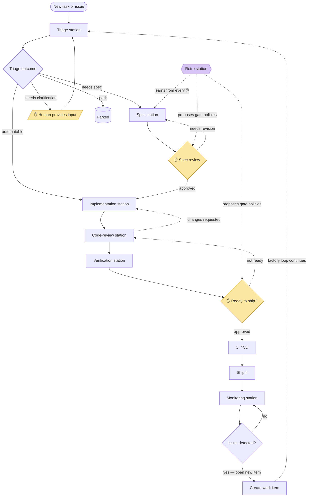

# The factory loop

This is the line encoded in [`line.yml`](../line.yml) — a faithful redraw of the source factory diagram. Stations are rectangles, human gates are diamonds, the dashed edges are the backward loops the learning loop tries to eliminate.

The one element not in the original diagram is the **Retro station** (purple), drawn with dashed edges into the stations and gates it improves — because in this factory the line doesn't just run, it re-tools itself from every human touch. See [LEARNING-LOOP.md](LEARNING-LOOP.md).
