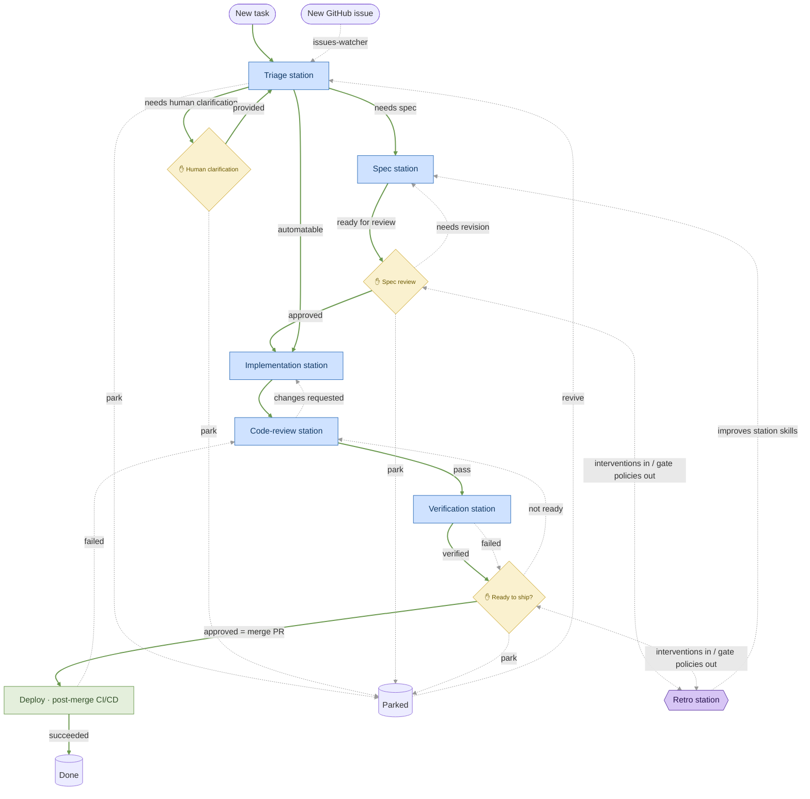

# The factory loop

This is the line encoded in [`line.yml`](../line.yml). **Stations are blue rectangles** (`deploy` is green-tinted because it's external — post-merge CI/CD, not an agent — and green means shipped), **human gates are soft-yellow ✋ diamonds**, **terminals are cylinders**. Solid green edges are the forward happy path; thin gray dashed edges are everything off it — the backward loops the learning loop tries to eliminate, plus the `park` shelving edges. `ship_review` approval means *merging the PR*, which triggers the post-merge CI/CD `deploy` — a green deploy (health-wait baked in) is the ship point, so the item is *done* when it ships. Continuous monitoring is deferred; the intended intake for new work is an **issues-watcher** that files GitHub issues into triage (see [OPTIMIZATION-AREAS.md](OPTIMIZATION-AREAS.md)).

A pre-rendered copy lives at [`diagram.png`](diagram.png) — regenerate it with `scripts/render-diagram.sh` after editing the diagram below.

Not drawn: the `blocked` gate — any station can force an item there via its report's `human_required` escape hatch (and `spec`/`implement` route there explicitly), after which the human either unblocks it back to triage or parks it.

The **Retro station** (purple) closes the learning loop: every human intervention at a gate feeds it, and it proposes improvements back — sharper station skills, gate policies that auto-clear proven-safe items — because in this factory the line doesn't just run, it re-tools itself from every human steer. See [LEARNING-LOOP.md](LEARNING-LOOP.md). (Note: `verify` routes to the ship gate on both `verified` and `failed` — the human always sees verification output — but only `verified` is the happy path, so `failed` is drawn dashed.)
